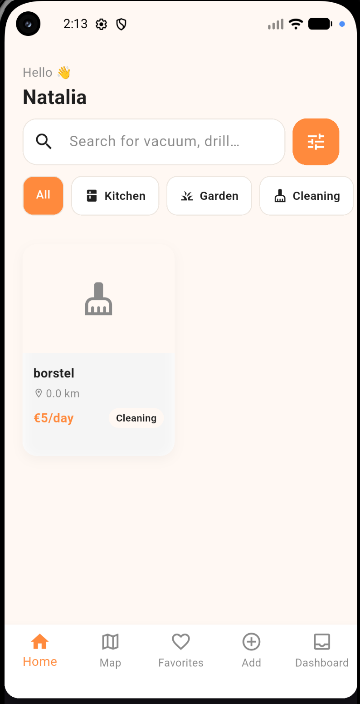
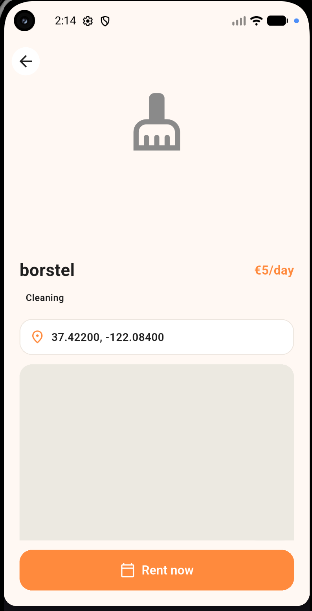
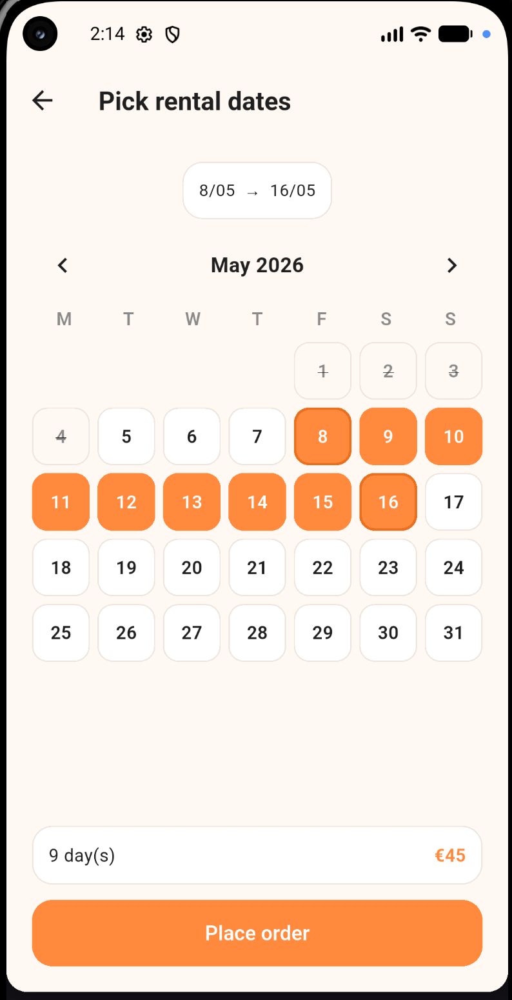
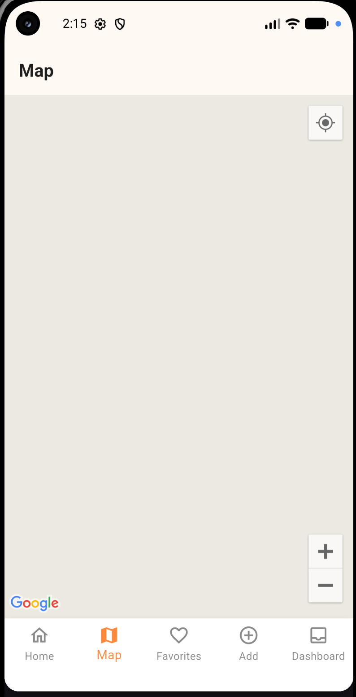

# Voortgangsverslag LocalLend

**Datum:** 29/04/2026
**Deadline:** 06/05/2026

## Toegevoegde functionaliteiten deze week

### 1. Project setup
- Nieuw Flutter project opgezet
- Mobile view werkend in emulator

### 2. Navigatie & schermen
- Home scherm
- Booking scherm
- Item Detail scherm
- Navigatie tussen schermen geïmplementeerd
- Booking functionaliteit toegevoegd

### 3. Configuratie
- `dotenv` ondersteuning toegevoegd
- Environment variables / configuratiebeheer

### 4. Google Maps integratie
- Google Maps functionaliteit geïntegreerd
- Adres selectie via Places API
- `sessionToken` handling correct geïmplementeerd in PlacesService

### 5. Documentatie
- README.md geüpdatet met projectdetails, features en setup instructies
- SETUP.md aanwezig

## Screenshots

> TODO: voeg hier screenshots toe van:

